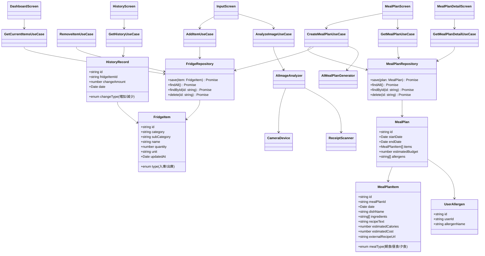

# 統合献立作成AIアプリ

## アプリ概要
- アプリ名：統合献立作成AIアプリ  
- ターゲットデバイス：Android / iPhone  
- 使用言語：TypeScript  
- フレームワーク：React Native  
- 設計思想：Clean Architecture、DDD準拠のディレクトリ構造  
- ローカルDB：SQLite  

## 目的
冷蔵庫の中身をAIと手入力で管理し、ユーザーがダッシュボードで内容を把握し、履歴で増減を確認できるようにする。  
さらに、AIを使って冷蔵庫の中身から献立を作成し、ユーザーの日々の食事計画をサポートする。

## 献立作成機能の特徴
1. **AIによる献立作成**  
   - 冷蔵庫の中身から最適な献立をAIが提案  
   - 最大で1ヶ月分の献立を作成可能  

2. **アレルゲン対応**  
   - ユーザーのアレルギー情報に基づいた献立提案  

3. **予算管理**  
   - 献立ごとの予算をAIが推定して表示  
   - 冷蔵庫の中身を優先的に使用し、不足分は購入前提で計算  

4. **カロリー管理**  
   - 献立ごとのカロリーの目安をAIが出力  

5. **詳細なレシピ提供**  
   - 献立の詳細な作り方をテキストで提供  
   - 料理サイトへの誘導機能も搭載  

## 画面構成
1. **ダッシュボード画面**  
   - 現在の冷蔵庫の中身を一覧表示  

2. **入力画面**（3種類の入力方法を提供）  
   - 方法①：冷蔵庫の中身をカメラ撮影 → AI画像分析 → 手入力補正 → 登録  
   - 方法②：買い物レシートをカメラ撮影 → AI画像分析 → 手入力補正 → 登録  
   - 方法③：手入力 → 登録  
   - 入出庫操作により、冷蔵庫の中身を「増やす / 減らす」ことが可能（家計簿の収入・支出に相当）  

3. **履歴画面**  
   - 日々の冷蔵庫の中身の増減を表示  

4. **献立作成画面**  
   - 冷蔵庫の中身をもとにAIが献立を提案  
   - 期間指定（1日〜最大1ヶ月）が可能  
   - アレルゲン情報の入力・管理  

5. **献立詳細画面**  
   - 選択した献立の詳細情報を表示  
   - 予算の目安（AIによる推定値）  
   - カロリーの目安  
   - 詳細な作り方（テキスト）  
   - 料理サイトへのリンク（外部誘導）  

## 入力データ仕様
- **入出庫**（入庫 or 出庫）  
- **大分類**（例：肉類、野菜類、乳製品、飲料、調味料、酒類など）  
- **小分類**（例：ハム、ベーコン、牛肉、豚肉、鶏肉など）  
- **名称**（例：部位、一般名称。加工食品は製品名も可）  
- **数量**  
- **単位**  
- **更新日**（入出庫日）  

## アーキテクチャ設計方針
- **Clean Architecture** を採用し、以下のような変更容易性を確保する
  - Web  
  - DB  
  - UI  
  - Devices（カメラ、スマホ機能など）  
  - External Interfaces（AI画像認識APIなど）  

## ディレクトリ戦略（DDD準拠）
```
src/
├── application/ # UseCase層
├── domain/ # Entity, ValueObject, RepositoryInterfaceなど
├── infrastructure/ # DB, 外部API実装
├── interfaces/ # UIや外部デバイスとのIF
├── presentation/ # React Nativeコンポーネント（UI層）
└── utils/ # 共通ユーティリティ
```

---

## クラス図（Mermaid）



## ユースケース図（Mermaid）

```plantuml
    actor User
    actor AI as "AI画像解析サービス"
    actor Camera as "カメラデバイス"
    actor MealPlanAI as "AI献立生成サービス"
    actor RecipeSite as "料理サイト"

    User --> (冷蔵庫の中身を確認する)
    User --> (食材を登録する)
    User --> (食材を消費する)
    User --> (履歴を確認する)
    User --> (献立を作成する)
    User --> (献立詳細を確認する)
    User --> (アレルゲンを登録する)

    (食材を登録する) --> (カメラ撮影して登録)
    (食材を登録する) --> (レシート撮影して登録)
    (食材を登録する) --> (手入力して登録)

    (カメラ撮影して登録) --> Camera
    (レシート撮影して登録) --> Camera
    (カメラ撮影して登録) --> AI
    (レシート撮影して登録) --> AI

    (献立を作成する) --> MealPlanAI
    (献立を作成する) ..> (冷蔵庫の中身を確認する)
    (献立を作成する) ..> (アレルゲンを登録する)

    (献立詳細を確認する) --> (予算を確認する)
    (献立詳細を確認する) --> (カロリーを確認する)
    (献立詳細を確認する) --> (レシピを確認する)
    (献立詳細を確認する) --> (料理サイトへ移動する)

    (料理サイトへ移動する) --> RecipeSite
```
