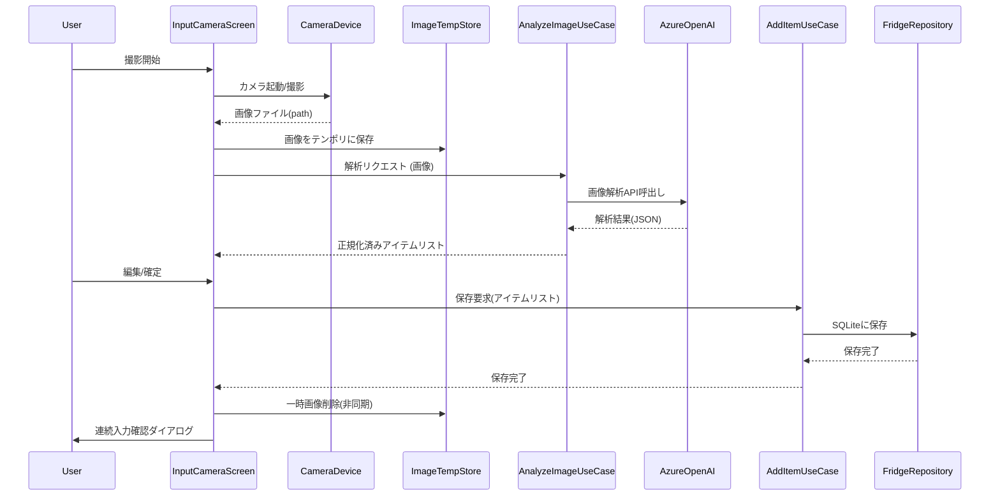

# 入力画面：方法① — カメラ撮影による食材登録設計

## 概要
カメラで撮影した写真をAI（Azure OpenAI）で解析し、判定された食材候補をユーザーが確認・補正してローカルSQLiteに登録する機能の設計。

## 目的
- 撮影だけで手軽に食材登録を行い、冷蔵庫管理の負荷を下げる。  
- AI判定をユーザーが補正することで登録精度を確保する。  
- 連続入力を簡便にし、買い物直後の登録を高速化する。

## 主な要件
- 撮影画像は一時領域（テンポラリ）に保存し、解析後は必要に応じて削除する。  
- AzureOpenAI呼び出しは画像を読み込み、JSONで食材リストを返却する（大分類、小分類、名称、数量、単位）。  
- UIで一覧表示・編集後、確定するとSQLiteに保存。  
- 保存後、連続入力の意思を確認し、分岐（続ける→撮影へ、やめる→ダッシュボードへ）。

## 画面（InputCameraScreen）構成要素
- ヘッダー（戻る、ヘルプ）  
- 撮影ボタン（カメラ起動 / カメラプレビュー）  
- プレビュー（撮影後の画像表示）  
- 解析中インジケーター（プログレス）  
- AI判定結果リスト（編集可能行）
  - 行項目：大分類（ドロップダウン）、小分類（オート補完）、名称（テキスト）、数量（数値）、単位（ドロップダウン）、削除ボタン
- 一括編集ショートカット（全数量を同一単位に変換など）  
- 確定ボタン（SQLiteへ保存）  
- キャンセル／再撮影ボタン  
- 保存完了ダイアログ（「続けて入力しますか？」→ はい/いいえ）

## 処理の流れ（ステップ）
1. ユーザーが撮影ボタンを押す（CameraDevice呼び出し）  
2. 取得画像をテンポラリ領域に保存（ファイル名は UUID + timestamp）  
   - 保存先: アプリ外部キャッシュディレクトリ（プラットフォーム毎に分岐）  
   - メタ: userId, captureAt を付与  
3. 画像をAzureOpenAI解析用に送付（AnalyzeImageUseCase）
   - リクエスト: 画像ファイルパス or base64 + モデル指定 + 推論パラメータ  
   - タイムアウト、リトライ（最大2回）を実装  
4. AzureOpenAI からの返却（JSON形式例）
   - 仕様は下記「AI返却JSON定義」を参照  
5. 解析結果を画面でリスト表示（編集可能）  
   - 各行は未確定状態（ローカルUI状態）  
   - ユーザーが編集/削除/追加可能  
6. ユーザーが「確定」を押下すると Validate を実行（必須項目チェック、数量の正規化）  
7. SQLiteへ保存（FridgeRepository.saveを通じて HistoryRecord も生成）  
   - トランザクションで複数行を一括保存  
8. テンポラリ画像は即時または一定期間後に削除（プライバシー方針参照）  
9. 保存完了ダイアログで「連続入力しますか？」を確認
   - Yes → フロー開始へ（カメラ起動）  
   - No → ダッシュボードへ遷移

## AI返却JSON定義（契約）
例:
{
  "imageId": "uuid",
  "items": [
    {
      "category": "野菜類",
      "subCategory": "葉物",
      "name": "ほうれん草",
      "quantity": 1.5,
      "unit": "束",
      "confidence": 0.87
    },
    ...
  ],
  "warnings": ["一部数値は推定です"]
}

- category, subCategory, name: string（可能ならコード化した列挙値も併記）  
- quantity: number（推定値／null許容）  
- unit: string（統一辞書にマップする）  
- confidence: 0.0–1.0（UIで低信頼はハイライト）  
- warnings: string[]（解析上の注意事項）

## データ仕様（SQLiteへ保存するエンティティ）
- FridgeItem
  - id: string (UUID)
  - category: string
  - subCategory: string
  - name: string
  - quantity: number
  - unit: string
  - source: enum { CAMERA, RECEIPT, MANUAL }
  - sourceImageId: string | null
  - createdAt: Date
- HistoryRecord（入庫として生成）
  - id, fridgeItemId, changeType: "増加", changeAmount, date

## ユースケース / クラスマッピング
- CameraDevice (interfaces/) — 撮影・画像取得  
- ImageTempStore (infrastructure/) — 一時保存、GC/削除  
- AnalyzeImageUseCase (application/) — AzureOpenAI呼出し・結果正規化  
- FridgeRepository (domain/infrastructure) — SQLite保存  
- AddItemUseCase (application/) — バリデーション + 保存 + 履歴生成  
- InputCameraScreen (presentation/) — UI

## エラーハンドリング
- カメラ拒否: 権限説明ダイアログ表示、設定へのリンク  
- 画像保存失敗: 再撮影を促すエラー表示  
- AI呼出し失敗（タイムアウト等）: 再試行案内・ローカル編集で保存可能にする（オフライン対応）  
- 保存失敗: ロールバック、ユーザー通知、ログ保存

## プライバシー / セキュリティ
- 画像は最小限の保持（デフォルト24時間以内に削除）  
- 送信前にユーザーに同意を求める（利用規約・プライバシー）  
- 画像送信はTLS、認証付きAPIキーで行う。キーは安全に管理（OSキーチェーン等）。

## UI/UX備考
- 低信頼（confidence < 0.6）は初期で編集フォーカスを当てる。  
- 数量の単位は既知辞書で変換候補を提示（g⇄kg、ml⇄L、個⇄pcs等）。  
- 一度に複数アイテムが検出される想定のため、リストでの一括選択／一括削除を用意。  
- 連続入力時は「簡易撮影モード」（即撮影→解析→確定ボタンのみ）を提供。

## シーケンス図（Mermaid）

## 実装上の注意
- AzureOpenAI のレスポンス仕様は変更される可能性があるため、パーサー層で堅牢に扱う。  
- ローカルの単位辞書とカテゴリマッピングを容易に更新できるよう外部設定化する。  
- 大量撮影（連続入力）を想定し、バックグラウンドでの保存・削除処理は非同期キューで扱う。  
