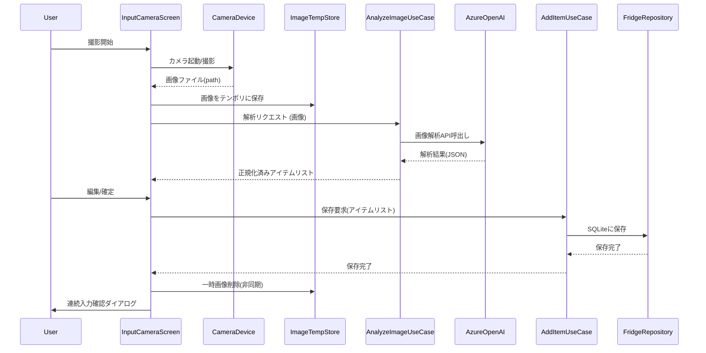

# 入力画面：方法① — カメラ撮影による食材登録設計

## 概要
カメラで撮影した写真をAI（Azure OpenAI）で解析し、判定された食材候補をユーザーが確認・補正してローカルSQLiteに登録する機能の設計。

## 目的
- 撮影だけで手軽に食材登録を行い、冷蔵庫管理の負荷を下げる。  
- AI判定をユーザーが補正することで登録精度を確保する。  
- 連続入力を簡便にし、買い物直後の登録を高速化する。

## 主な要件
- 撮影画像は一時領域（テンポラリ）に保存し、解析後は必要に応じて削除する。  
- AzureOpenAI呼び出しは画像を読み込み、JSONで食材リストを返却する（大分類、小分類、名称、数量、単位）。  
- UIで一覧表示・編集後、確定するとSQLiteに保存。  
- 保存後、連続入力の意思を確認し、分岐（続ける→撮影へ、やめる→ダッシュボードへ）。

## 画面（InputCameraScreen）構成要素
- ヘッダー（戻る、ヘルプ）  
- 撮影ボタン（カメラ起動 / カメラプレビュー）  
- プレビュー（撮影後の画像表示）  
- 解析中インジケーター（プログレス）  
- AI判定結果リスト（編集可能行）
  - 行項目：大分類（コンボボックス）、小分類（コンボボックス、大分類に応じて選択肢変更）、名称（テキスト）、数量（数値）、単位（コンボボックス）、削除ボタン
- 一括編集ショートカット（全数量を同一単位に変換など）  
- 確定ボタン（SQLiteへ保存）  
- キャンセル／再撮影ボタン  
- 保存完了ダイアログ（「続けて入力しますか？」→ はい/いいえ）

## 処理の流れ（ステップ）
1. ユーザーが撮影ボタンを押す（CameraDevice呼び出し）  
2. 取得画像URIを取得
3. 画像をAzure OpenAI解析用に送付（AnalyzeImageUseCase）
   - expo-image-manipulatorでJPEG形式にしてBase64エンコード
   - Azure OpenAI SDK (`openai`パッケージ) を使用してAPI呼び出し
   - タイムアウト設定可能（デフォルト30秒）
4. Azure OpenAI からの返却（JSON形式例）
   - 仕様は下記「AI返却JSON定義」を参照  
   - 使用量情報（トークン数）も取得し、開発環境でコスト計算・表示
5. 解析結果を画面でリスト表示（編集可能）  
   - 各行は未確定状態（ローカルUI状態）  
   - ユーザーが編集/削除/追加可能  
   - 信頼度が低い（< 0.6）アイテムは警告色で表示
6. ユーザーが「確定」を押下すると Validate を実行（必須項目チェック、数量の正規化）  
7. SQLiteへ保存（FridgeRepository.saveを通じて HistoryRecord も生成）  
   - AddItemUseCase.executeBatch で複数行を一括保存
8. 保存完了ダイアログで「連続入力しますか？」を確認
   - Yes → フロー開始へ（カメラ起動）  
   - No → 入力方法選択画面へ遷移

## AI返却JSON定義（契約）
Azure OpenAI (gpt-4o等のVisionモデル) から返却されるJSON形式:
```json
{
  "items": [
    {
      "category": "野菜類",
      "subCategory": "葉物野菜",
      "name": "ほうれん草",
      "quantity": 1.5,
      "unit": "束",
      "confidence": 0.87
    },
    ...
  ]
}
```

- category: string（大分類: 肉類、野菜類、果物、魚介類、乳製品、卵、豆類、穀類、調味料、飲料、酒類、加工食品、その他）  
- subCategory: string（小分類: 大分類に応じた詳細分類）  
- name: string（食材名）  
- quantity: number（推定値）  
- unit: string（単位: 個、本、束、パック、袋、g、kg、ml、L、枚、切れ、セット、その他）  
- confidence: 0.0–1.0（信頼度スコア、UIで低信頼はハイライト）

### Azure OpenAI設定
AI解析には Azure OpenAI サービスを使用します。設定は「その他」タブで行います：
- エンドポイント（必須）
- APIキー（必須）
- モデル名（必須、推奨: gpt-4o）
- APIバージョン（必須、デフォルト: 2024-02-15-preview）
- タイムアウト時間（秒）（デフォルト: 30秒）

**使用技術:**
- `openai` (v4.77.1+): 公式Azure OpenAI SDK
- `expo-image-manipulator`: 画像のJPEG変換とBase64エンコード
- 開発環境では自動的にトークン使用量とコストをコンソール出力

## データ仕様（SQLiteへ保存するエンティティ）
- FridgeItem
  - id: string (UUID)
  - category: string
  - subCategory: string
  - name: string
  - quantity: number
  - unit: string
  - source: enum { CAMERA, RECEIPT, MANUAL }
  - sourceImageId: string | null
  - createdAt: Date
- HistoryRecord（入庫として生成）
  - id, fridgeItemId, changeType: "増加", changeAmount, date

## ユースケース / クラスマッピング
- CameraDevice (interfaces/) — 撮影・画像取得  
- AnalyzeImageUseCase (application/) — Azure OpenAI SDK呼出し・結果正規化  
- AzureOpenAIImageAnalyzer (infrastructure/external-services/) — 実際のAzure OpenAI SDK連携
  - `openai` パッケージの `AzureOpenAI` クライアントを使用
  - `expo-image-manipulator` で画像をJPEG/Base64変換
  - トークン使用量の取得とコスト計算
  - 開発環境でのデバッグ情報出力
- ConfigRepository (domain/repositories/) — Azure OpenAI設定の保存・取得  
- InMemoryConfigRepository (infrastructure/repositories/) — 設定の実装（将来的にSecureStoreに移行）  
- FridgeRepository (domain/infrastructure) — SQLite保存  
- AddItemUseCase (application/) — バリデーション + 一括保存 (executeBatch) + 履歴生成  
- InputCameraScreen (presentation/) — カメラ撮影・解析UI  
- SettingsScreen (presentation/) — Azure OpenAI設定UI

## エラーハンドリング
- カメラ拒否: 権限説明ダイアログ表示、設定へのリンク  
- 画像保存失敗: 再撮影を促すエラー表示  
- AI呼出し失敗（タイムアウト等）: 再試行案内・ローカル編集で保存可能にする（オフライン対応）  
- 保存失敗: ロールバック、ユーザー通知、ログ保存

## プライバシー / セキュリティ
- 画像は最小限の保持（デフォルト24時間以内に削除）  
- 送信前にユーザーに同意を求める（利用規約・プライバシー）  
- 画像送信はTLS、認証付きAPIキーで行う。キーは安全に管理（OSキーチェーン等）。

## UI/UX備考
- 低信頼（confidence < 0.6）は初期で編集フォーカスを当てる。  
- 数量の単位は既知辞書で変換候補を提示（g⇄kg、ml⇄L、個⇄pcs等）。  
- 一度に複数アイテムが検出される想定のため、リストでの一括選択／一括削除を用意。  
- 連続入力時は「簡易撮影モード」（即撮影→解析→確定ボタンのみ）を提供。

## シーケンス図（Mermaid）

```mermaid
sequenceDiagram
  User->>InputCameraScreen: 撮影開始
  InputCameraScreen->>CameraDevice: カメラ起動/撮影
  CameraDevice-->>InputCameraScreen: 画像ファイル(path)
  InputCameraScreen->>ImageTempStore: 画像をテンポリに保存
  InputCameraScreen->>AnalyzeImageUseCase: 解析リクエスト (画像)
  AnalyzeImageUseCase->>AzureOpenAI: 画像解析API呼出し
  AzureOpenAI-->>AnalyzeImageUseCase: 解析結果(JSON)
  AnalyzeImageUseCase-->>InputCameraScreen: 正規化済みアイテムリスト
  User->>InputCameraScreen: 編集/確定
  InputCameraScreen->>AddItemUseCase: 保存要求(アイテムリスト)
  AddItemUseCase->>FridgeRepository: SQLiteに保存
  FridgeRepository-->>AddItemUseCase: 保存完了
  AddItemUseCase-->>InputCameraScreen: 保存完了
  InputCameraScreen->>ImageTempStore: 一時画像削除(非同期)
  InputCameraScreen->>User: 連続入力確認ダイアログ
```

## 実装上の注意
- AzureOpenAI のレスポンス仕様は変更される可能性があるため、パーサー層で堅牢に扱う。  
- ローカルの単位辞書とカテゴリマッピングを容易に更新できるよう外部設定化する。  
- 大量撮影（連続入力）を想定し、バックグラウンドでの保存・削除処理は非同期キューで扱う。  
